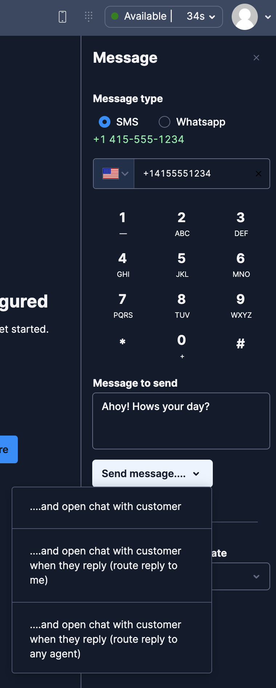
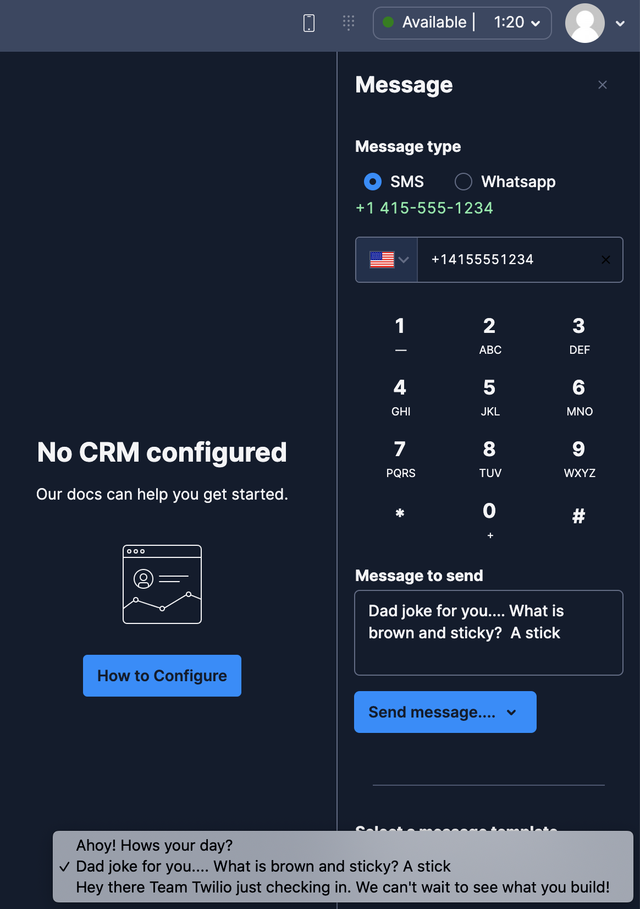

# Outbound Messaging Panel Plugin for Flex 2.0

## Disclaimer

**This software is to be considered "sample code", a Type B Deliverable, and is delivered "as-is" to the user. Twilio bears no responsibility to support the use or implementation of this software.**

## Pre-Requisites

**This plugin makes use of Conversations Based Messaging and Paste in Flex which is a dependency on Flex 2.0**

## WhatsApp Templates and the 24-Hour Session

WhatsApp requires business-initiated conversations to open with an approved Content template — free-form messages only work inside a 24-hour window that starts when the customer last messaged the business.

The plugin surfaces this rule directly in the panel:

- When WhatsApp is selected and the destination is valid, the plugin looks up the most recent inbound message from the customer via the Conversations API. It shows a **green callout** ("Inside the 24-hour session") when free-form is allowed and a **warning callout** ("Template required") when it isn't.
- Outside the window the free-form textarea is disabled and the agent must pick a template.
- The "Select a Message" dropdown for WhatsApp lists only templates whose WhatsApp approval status is `approved` (the same set the Console labels as *WhatsApp business initiated*). This is powered by the `content.v2.contentAndApprovals` endpoint filtered by `channelEligibility=whatsapp:approved`.
- Templates with placeholders (`{{1}}`, `{{2}}`, ...) render one input per placeholder, pre-filled from the template's stored sample values. A preview of the assembled message is shown below the inputs. The values are passed to Twilio as `ContentVariables` on the Conversations message.

Additional context on the underlying rule: [Upgrading WhatsApp Templates to Content Templates](https://help.twilio.com/articles/19816296822299-Upgrading-WhatsApp-Templates-to-Content-Templates).

## Solution Overview

This plugin is intended to demonstrate the [Interactions API](https://www.twilio.com/docs/flex/developer/conversations/interactions-api), [Flex Conversations](https://www.twilio.com/docs/flex/conversations) and [Paste](https://paste.twilio.design/). The outbound SMS and WhatsApp code was inspired by the examples in [this blog on Flex Conversations](https://www.twilio.com/blog/flex-conversations-public-beta)

A new panel is added that has a similar look and feel to the native outbound voice panel but handles the outbound messaging use case.

When sending the message the agent has the option to:

- Open a chat (creates a channel, adds the message and creates a task with the agent to open a message based task)
- Send a message and wait for the customer to reply (create a channel, add the message and setup a studio webhook to handle the inbound)
  - When the reply comes in route to the agent that sent the message (or)
  - When the reply comes in route to any agent

To route the inbound customer message task back to the agent that sent the message is achieved by adding the worker friendly name to the conversation channels attributes and studio can then set the task attributes as required.

## Canned Messages notes

For SMS the "Select a Message" dropdown offers a hard-coded canned list from `src/utils/templates.js`. A production deployment would typically replace this with an endpoint that fetches the current list from a config store.

The 24-hour session detection and business-initiated template flow described above make WhatsApp compliant by default; the canned-list pattern here is SMS-only.

Our docs cover WhatsApp Templates in more detail [here.](https://www.twilio.com/docs/whatsapp/tutorial/send-whatsapp-notification-messages-templates)

## Actions

The plugin adds two [Flex actions](https://www.twilio.com/docs/flex/developer/ui/actions) that could be reused - for example to implement Click to Message.

- ToggleOutboundMessagePanel

  Toggles the panel - the plugin uses this from the Message icon in the main header

- SendOutboundMessage

  Sends the message and is triggered from the Send message button

## Screenshots





## Setup

### Pre-Requisites for Setup

- An active Twilio account with Flex provisioned. Refer to the [Flex Quickstart](https://www.twilio.com/docs/flex/quickstart/flex-basics#sign-up-for-or-sign-in-to-twilio-and-create-a-new-flex-project") to create one.
- A phone number or Whatsapp sender [configured for Flex Conversations](https://www.twilio.com/docs/flex/admin-guide/setup/conversations/manage-conversations-sms-addresses)
- npm version 9.0.0 or later installed (type `npm -v` in your terminal to check)
- Node.js version 18 or later installed (type `node -v` in your terminal to check)
- [Twilio CLI](https://www.twilio.com/docs/twilio-cli/quickstart#install-twilio-cli) along with the [Flex CLI Plugin](https://www.twilio.com/docs/twilio-cli/plugins#available-plugins) and the [Serverless Plugin](https://www.twilio.com/docs/twilio-cli/plugins#available-plugins). Run the following commands to install them:

  ```bash
  # Install the Twilio CLI
  npm install twilio-cli -g
  # Install the Serverless and Flex as Plugins
  twilio plugins:install @twilio-labs/plugin-serverless
  twilio plugins:install @twilio-labs/plugin-flex
  ```

### Serverless

Deploy the serverless functions

```
cd serverless/outbound-messaging
twilio serverless:deploy
```

and note the domain that is created (we will add this to the plugin config)

### Run Plugin Locally

Copy the `template.env` file to a new `.env` file and update the sids, phone number to be a Twilio number within the account and the domain that was created during the Serverless deployment.

```
FLEX_APP_TWILIO_SERVERLESS_DOMAIN=https://xxx.twil.io
FLEX_APP_WORKSPACE_SID=WSxxx  # Used for creating an outbound chat task
FLEX_APP_WORKFLOW_SID=WWxxx  # Used for creating an outbound chat task
FLEX_APP_QUEUE_SID=WQxxx  # Used for creating an outbound chat task
FLEX_APP_INBOUND_STUDIO_FLOW=FWxxx  # Used for handling the reply of outbound chats without a task
FLEX_APP_TWILIO_FROM_NUMBER=+1xxxx  # Comma separated to offer multiple senders
FLEX_APP_TWILIO_WHATSAPP_FROM_NUMBER=+1xxxx  # Comma separated to offer multiple senders

# WhatsApp template display control (optional)
FLEX_APP_DISPLAY_ALL_TEMPLATE=1  # 1 = show all business-initiated templates (default); 0 = show only the SIDs listed below
FLEX_APP_TWILIO_WHATSAPP_TEMPLATES=[HXxxxxxxxxxxxxxxxxxxxxxxxxxxxxxxxx, HXxxxxxxxxxxxxxxxxxxxxxxxxxxxxxxxx]  # Allowlist of Content Template SIDs; used only when FLEX_APP_DISPLAY_ALL_TEMPLATE=0
```

#### Controlling which WhatsApp templates appear

By default the outbound WhatsApp panel lists every business-initiated Content Template returned by the `getContentTemplates` serverless function. To restrict the dropdown to a curated list:

1. Set `FLEX_APP_DISPLAY_ALL_TEMPLATE=0`.
2. Populate `FLEX_APP_TWILIO_WHATSAPP_TEMPLATES` with the Content Template SIDs you want to expose (comma-separated; brackets and whitespace are ignored, so both `HX...,HX...` and `[HX..., HX...]` work).

If the flag is `0` but the allowlist is empty, the plugin falls back to showing every template so agents are never left with an empty dropdown. These are `FLEX_APP_*` variables, so they are baked into the bundle at build time — any change requires a rebuild (`twilio flex:plugins:start` locally, or a redeploy).

```
# Install Dependencies
npm install

# Start Flex Plugins
twilio flex:plugins:start
```

### Deploy Plugin

After testing the plugin locally you can deploy the plugin to your account using the [Flex Plugins CLI](https://www.twilio.com/docs/flex/developer/plugins/cli/deploy-and-release)

Run the following command to start the deployment:

```bash
twilio flex:plugins:deploy --major --changelog "Notes for this version" --description "Functionality of the plugin"
```

After your deployment runs you will receive instructions for releasing your plugin from the bash prompt. You can use this or skip this step and release your plugin from the Flex plugin dashboard here https://flex.twilio.com/admin/plugins

For more details on deploying your plugin, refer to the [deploying your plugin guide](https://www.twilio.com/docs/flex/plugins#deploying-your-plugin).

### Studio SendToFlex

To handle the use case of inbound replies from the customer needing to create a task and optionally routing it to the agent that initiated the outbound message we will make use of the sendOutboundSMS function populating the conversations channel attributes.

These are then available in the trigger and modifying the SendToFlex attributes as below will populate the task attributes for the TaskRouter Workflow.

```
{"KnownAgentRoutingFlag":"{{trigger.conversation.ChannelAttributes.KnownAgentRoutingFlag}}", "KnownAgentWorkerSid":"{{trigger.conversation.ChannelAttributes.KnownAgentWorkerSid}}"}
```

### TaskRouter Workflow

This workflow assumes that studio has populated the Task Attributes with

- AttributesKnownAgentRoutingFlag
- KnownAgentWorkerFriendlyName

```
{
  "task_routing": {
    "filters": [
      {
        "filter_friendly_name": "Known Agent Routing Filter",
        "expression": "KnownAgentRoutingFlag == \"true\"",
        "targets": [
          {
            "queue": "WQxxxx",
            "known_worker_sid": "task.KnownAgentWorkerSid"
          }
        ]
      }
    ],
    "default_filter": {
      "queue": "WQxxxx"
    }
  }
}
```

### Content Templates

Content templates are wired in by default for WhatsApp — no feature flag is required. The panel fetches templates from `content.v2.contentAndApprovals` filtered to `whatsapp:approved`, so only WhatsApp business-initiated templates appear.

Kudos to @cullenwatson for the original contribution that seeded this integration.

Optional allow-list: the `serverless/outbound-messaging/assets/contentTemplateFilters.private.js` asset can restrict the templates returned to the plugin. Update the account SID and list of Content Template SIDs — for `ACxxx` only `HXxxx` and `HXyyy` would be available for selection:

```
 {
  enabled: true,
  accounts: {
    ACxxx: [
      "HXxxx",
      "HXYYY",
    ],
  },
};
```

Template variables (`{{1}}`, `{{2}}`, ...) are rendered as inline inputs, pre-filled from the template's saved sample values. The values travel to Twilio as `ContentVariables` on the Conversations `messages.create` call, keeping the whole flow on the Conversations architecture.
